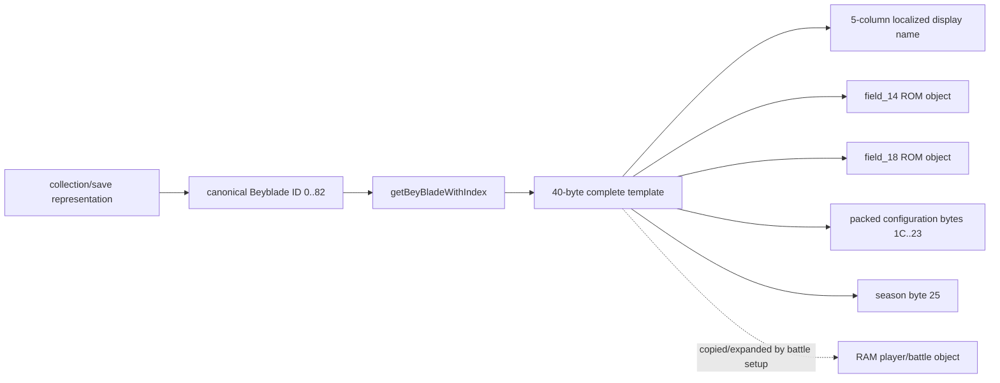

# Task 2 evidence ledger

Every conclusion uses the repository confidence vocabulary.

## Confirmed direct binary evidence

* The complete-template table occupies ROM `0x0007A1F4`–`0x0007AEE3` (runtime `0x0807A1F4`–`0x0807AEE3`): 83 fixed 40-byte records.
* Thumb function `0x0803DCFC` rejects indices above 82, computes `index * 5 * 8`, and adds literal `0x0807A1F4`. This confirms index, count, stride, and base.
* Thumb function `0x0803DC70` iterates 83 rows by adding 40, compares the signed byte at row offset `0x25` to its season argument, retains at most 32 matching IDs, and returns a selected row.
* Each record's first five words are valid ROM pointers. All five point to the same proper-name string in this US build. They are language columns, supported by the four localized `None` spellings immediately before adjacent lookup data.
* Parsing and serializing all 83 raw records is byte-perfect.

## Strongly supported structural inference

The records are display/configuration templates rather than component records: they combine five localization pointers, two distinct ROM data pointers, eight packed bytes, a season byte, and two trailing unknown bytes. The two pointers target large non-string data regions and remain neutrally named until Task 3 or runtime observation establishes their roles.

## Construction relationship

The collection-to-ID and template-to-runtime edges are strongly supported/candidate rather than runtime-confirmed.
