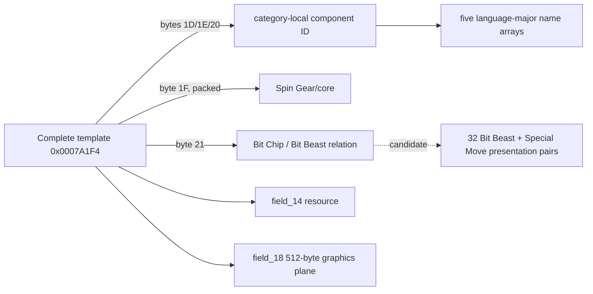

# Component, Bit Beast, and move tables (Task 3)

## Results and confidence

Four component-name tables are **confirmed**. They use category-local,
zero-based IDs and five language-major arrays of 32-bit ROM pointers. There is
no `None` row in these arrays. The exact extents are:

| Category | ROM start | End-exclusive | IDs/count |
|---|---:|---:|---:|
| Spin Gears / cores | `0x0007AF0C` | `0x0007B0C4` | `0..21` / 22 |
| Attack Rings | `0x0007B0D8` | `0x0007B6DC` | `0..76` / 77 |
| Blade Bases | `0x0007B824` | `0x0007BB6C` | `0..41` / 42 |
| Weight Disks | `0x0007BC28` | `0x0007BDA4` | `0..18` / 19 |

The intervening bytes are not silently incorporated into name arrays. They are
**candidate** numeric/stat or presentation tables and remain under neutral
names until an executable consumer is established. Bit Chips use a separate
ID space (observed IDs `3..70`); their master/name representation is still
**unknown**. Searches also found launcher, ripcord, grip, Engine Gear, shop and
consumable UI strings, but strings alone are not records, so no unsupported
master-table claim is made for those categories.

## Mixed lookup region

`0x000796DC..0x00079CF4` is concatenated presentation data, not one table.
`0x000796DC` starts two five-pointer localized `None` rows, followed by pairs
of duplicate five-pointer complete-name rows. At `0x00079CF4` the shape changes
to exactly 32 adjacent pairs: one Bit Beast row and one Special Move row. Each
row is 20 bytes (five language pointers), each pair 40 bytes, and the array ends
exactly at the complete-template base `0x0007A1F4`. Some “move” rows repeat the
Bit Beast name; this is preserved rather than interpreted as a sentinel.

## Complete-template relationship

The 83 templates make the category relation **strongly supported**:

| Template byte | Interpretation | Range | Confidence |
|---:|---|---:|---|
| `0x1C` | `field_1c_u8` | `0..3` | unknown |
| `0x1D` | Attack Ring local ID | `0..76` | strongly_supported |
| `0x1E` | Weight Disk local ID | `0..18` | strongly_supported |
| `0x1F` | packed Spin Gear/core and flags | `0x12..0x95` | candidate |
| `0x20` | Blade Base local ID | `0..41` | strongly_supported |
| `0x21` | Bit Chip ID | `3..70` | strongly_supported |
| `0x22` | constant zero | `0` | confirmed value; unknown purpose |
| `0x23` | constant `0xFF` | `0xFF` | confirmed value; sentinel candidate |

The exact distributions are in `analysis/tables/components/field-statistics.json`.
The matching maxima and the ordering of the customization slots are structural
evidence, not proof of every gameplay semantic. In particular, Spin Gear uses
packed high bits and cannot be treated as a raw array index.



## Pointer object families

All 83 `field_14_ptr` targets are unique and span starts
`0x0027FA30..0x00299C90`. Every target starts `03 00 00 00`, has a repeated
structured header, and variable spacing to the next target. This is
**strongly_supported** as a sprite/animation resource-container family, not a
component table. Exact headers, inferred extents, and entropy are recorded in
`pointer-objects.json`; the final extent remains bounded rather than invented.

All 83 `field_18_ptr` targets are unique starts in
`0x0029A18C..0x002A458C`, with invariant `0x200` spacing in sorted order. Their
raw, pointer-free appearance and exact 512-byte size are
**strongly_supported** as presentation graphics planes. Neither family gives
evidence of stat aggregation or component construction.

## Relationship model and rejected hypotheses

`relationships.json` records every template-to-part edge with its evidence and
confidence. Rejected: (1) `0x000796DC` as one uniform table (row roles change);
(2) pointers `+0x14/+0x18` as component records (one-to-one presentation
objects, graphics-like structure); (3) raw byte `0x1F` as a Spin Gear ID
(values exceed 21); and (4) diagnostic strings as proof of executable function
identity.

## Regeneration

```bash
rm -rf analysis/generated/tables/components analysis/generated/tables/moves
python3 -m tools.gba.table_extract --rom "Beyblade G-Revolution (USA).gba" --table components --output analysis/generated/tables/components
python3 -m tools.gba.table_extract --rom "Beyblade G-Revolution (USA).gba" --table bit-beasts-and-moves --output analysis/generated/tables/moves
```


## Task 8 Blank Core boundary

The complete-Beyblade table remains count `83` at ROM `0x0007A1F4`, stride `0x28`; byte `+0x21` remains the Bit Chip identity foundation. Task 8 uses a virtual Blank Core ID `0xF0` in custom state only; no retail Bit Chip record is repurposed.
