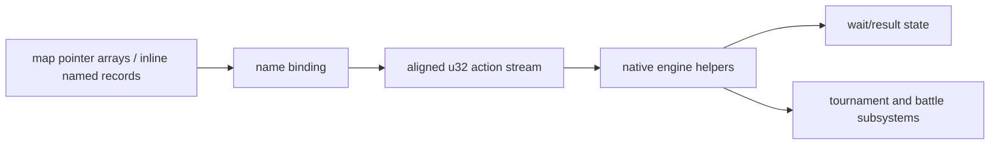

# Task 6: event and story architecture

## Result

**Strongly supported:** the campaign is a hybrid of data action streams and native
subsystems, not a table of Thumb callback functions.  At `0x00094F00` the ROM
contains pairs such as the `atDojo` string pointer and `0x080B52E8`; the latter
starts `04 00 00 00 04 00 00 00 ...`, aligned data rather than a Thumb or ARM
prologue.  All five `TriggerBattle` bindings point to the same stream at
`0x0809B350`.  Thus names select reusable action-word streams, while tournament
and progression behavior is native Thumb code.



The central action consumer, context layout, wait flags, and individual word
semantics remain **unknown**. Values are retained as `command_0xNN`, never
promoted merely because they recur. This is preferable to fabricating a VM.

## Exact anchors

The confirmed bindings are generated in `analysis/scripts/callback-registry.json`.
Pointers are normalized by subtracting `0x08000000` and bounds checked. The
low-ROM occurrence at `0x00002CB0` is a three-word header followed by
`atExitToStreets`; `atDojo` follows at `0x00002CD0`. Their record-family boundary
is still **candidate**, because a runtime consumer has not established every
field.

## Regeneration

```sh
python3 -m tools.gba.event_architecture --rom "Beyblade G-Revolution (USA).gba" --output analysis/generated/scripts/architecture.json
```

The command rejects every hash except the supported US SHA-256 unless
`--allow-unsupported` is explicitly supplied and never opens the ROM writable.
